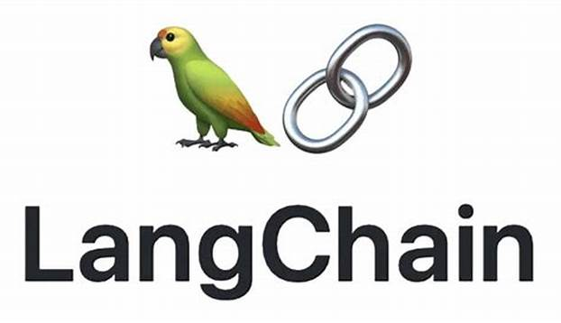

# LangChain Chatbot

## Overview

LangChain Chatbot is a conversational agent developed using the LangChain framework. It provides a platform for creating intelligent chatbots capable of interacting with users in multiple languages.

## Features

- **Customizable Responses**: Easily customize the chatbot's responses to suit your specific use case or application.
- **Integration Ready**: Seamlessly integrate the chatbot into your existing applications or services.

## Installation

To install and run the LangChain Chatbot locally, follow these steps:

1. Clone this repository: `git clone https://github.com/tanersekmen/langchain-chatbot.git
2. Install dependencies: `npm install`
3. Start the chatbot: `npm start`

## Usage

Once the chatbot is running, you can interact with it through various channels such as a web interface, messaging platforms, or APIs.
